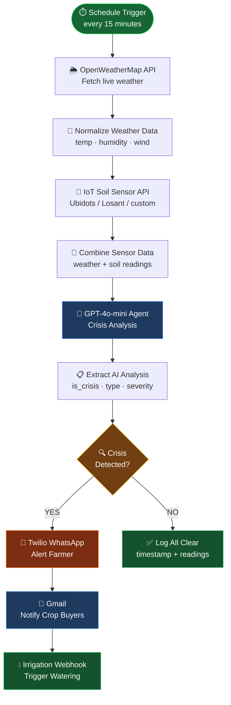

# 🌾 Smart Farm Crisis Response Agent

Real-time AI monitoring for agricultural crises using live weather data and IoT soil sensor readings. Detects drought, frost, heat stress, flooding, and storms — then auto-alerts farmers via WhatsApp, notifies crop buyers by email, and triggers irrigation.

> 🚀 **[Live Demo on Hugging Face Spaces](https://huggingface.co/spaces/Darkweb007/smart-farm-crisis-agent)** · 🔗 **[n8n Workflow](https://aravind5.app.n8n.cloud/workflow/3YhdfeaAg8uz8eEc)**

---

## 🏗️ Architecture



### Crisis Detection Logic

| Crisis | Sensor Condition | Severity |
|--------|-----------------|----------|
| 🏜️ **Drought** | Soil moisture **< 20%** AND humidity **< 30%** | High → Critical |
| 🥶 **Frost** | Air temp **< 2°C** OR soil temp **< 1°C** | High → Critical |
| 🔥 **Heat Stress** | Air temperature **> 38°C** | Medium → High |
| 🌊 **Flooding Risk** | Soil moisture **> 85%** | Medium → High |
| 🌪️ **Storm Risk** | Wind speed **> 15 m/s** | High → Critical |

### Response Pipeline

```
Crisis Confirmed
  ├─ 📱 WhatsApp (Twilio)  →  "🚨 DROUGHT ALERT – Fresno: Soil moisture 12%..."
  ├─ 📧 Gmail              →  Professional supply chain delay notice to buyers
  └─ 💧 HTTP Webhook       →  POST {"action":"start_irrigation","zone":"all","duration_minutes":30}
```

---

## 🎮 Try It — No API Key Needed

The Hugging Face Space has a **Live Demo tab** with 5 pre-built scenarios:

| Scenario | Location | Key Reading | Expected Output |
|----------|----------|-------------|-----------------|
| 🏜️ Drought Emergency | Fresno, CA | Moisture 12%, Humidity 18% | 🔴 CRITICAL |
| 🔥 Heat Stress | Phoenix, AZ | Temp 44°C, Soil 40°C | 🟠 HIGH |
| 🥶 Frost Risk | Minneapolis, MN | Soil temp 0.5°C | 🟠 HIGH |
| 🌊 Flooding Risk | Seattle, WA | Moisture 90% | 🟡 MEDIUM |
| ✅ All Clear | Dallas, TX | All normal | 🟢 LOW |

---

## ⚙️ Setup

### 1 · Hugging Face Space Secrets

Go to **Space Settings → Variables and Secrets** and add:

| Secret Name | Value |
|-------------|-------|
| `OPENAI_API_KEY` | `sk-...` from [platform.openai.com](https://platform.openai.com/api-keys) |
| `OPENWEATHER_API_KEY` | Free key from [openweathermap.org](https://openweathermap.org/api) |

### 2 · Local Development

```bash
git clone https://github.com/data-geek-astronomy/smart-farm-crisis-agent
cd smart-farm-crisis-agent
pip install -r requirements.txt

export OPENAI_API_KEY=sk-...
export OPENWEATHER_API_KEY=your_key_here

python app.py
# → http://localhost:7860
```

### 3 · n8n Workflow (Production Automation)

Fill in the 5 placeholders in the n8n workflow to go fully live:

| Node | Configure |
|------|-----------|
| **Fetch Weather Data** | Farm city name (e.g. `Fresno, CA`) |
| **Fetch Soil Sensor Data** | IoT sensor API URL + auth headers |
| **WhatsApp Alert to Farmer** | Twilio sender + farmer's WhatsApp number |
| **Notify Crop Buyers** | Buyer email addresses (comma-separated) |
| **Trigger Irrigation Order** | Your irrigation controller webhook URL |

Then hit **Activate** — the workflow polls every 15 minutes automatically.

---

## 🛠️ Tech Stack

| Layer | Technology |
|-------|-----------|
| AI Analysis | GPT-4o-mini (`response_format: json_object`) |
| Weather Data | OpenWeatherMap REST API |
| Soil Sensors | IoT HTTP endpoint (Ubidots / Losant / custom) |
| Automation | n8n (self-hosted or cloud) |
| Alerts | Twilio WhatsApp + Gmail via n8n |
| Irrigation | HTTP webhook to controller |
| Demo UI | Gradio 5.9.1 on Hugging Face Spaces |

---

## 📁 Project Structure

```
smart-farm-crisis-agent/
├── app.py            # Gradio UI — demo + live analysis
├── requirements.txt  # gradio, openai, requests
└── README.md         # This file
```

---

## 🔗 Links

- 🤗 [Hugging Face Space](https://huggingface.co/spaces/Darkweb007/smart-farm-crisis-agent)
- 🔗 [n8n Workflow](https://aravind5.app.n8n.cloud/workflow/3YhdfeaAg8uz8eEc)
- 🌦️ [OpenWeatherMap API](https://openweathermap.org/api)
- 🤖 [OpenAI API Keys](https://platform.openai.com/api-keys)

---

*Built with Gradio + GPT-4o-mini + OpenWeatherMap + n8n*
